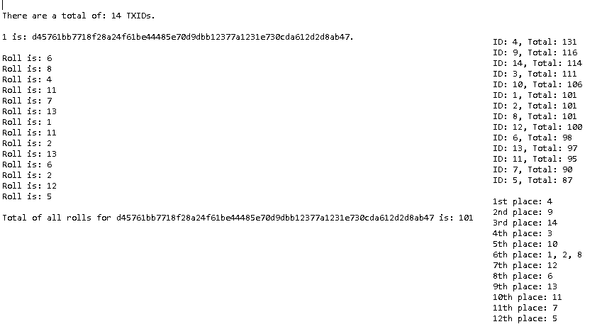
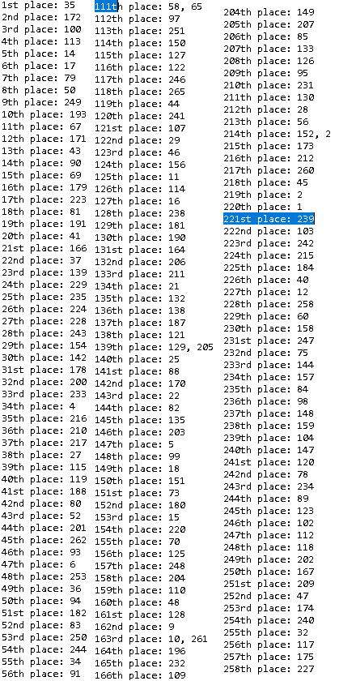
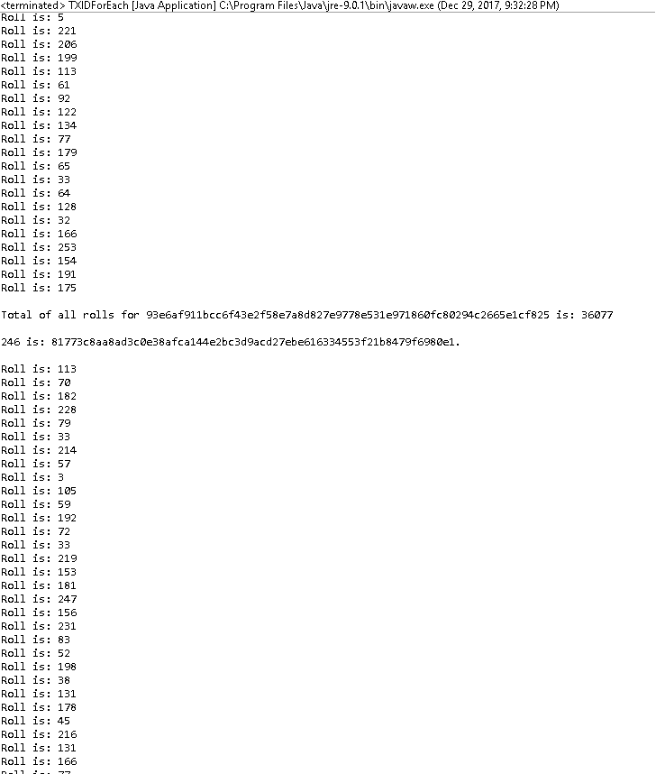

# WHO WE ARE 

A Blockchain-ledger based transparent and charitable gaming platform. We will develop 20 gaming products based on Stellar blockchain ledger.

# NEWS

We have decided to **give away** 2.2% of our Lifetime Token Supply **[924,000 Tokens]** during our bounty platform, ALPHA Wallet and THE FIRST: 50/50 Lotto Dice BETA launch phase. You will get to play on our platform and it's on us!

We have also decided to launch **Pre-Initial Coin Offering** Phase with **[4.2 Million Tokens]** (10% of Total Lifetime Tokens) @ [$0.25 per token] (scales to a maximum of $0.75 before ICO)

**Initial Coin Offering** Phase will see the launch of THE SECOND product ALPHA version and the public will be able to purchase a total of **[5.376 Million Tokens]** (12.8% of Total Lifetime Tokens) @ [$0.75 per Token] (scales after ICO).

[Note]: You can use all major [Cryptocurrencies] and [USDT] or [EURT] to purchase tokens. **[Total of 42 Million Tokens to ever be generated!]**

Happy New YEAR and See you in 2018!

# The First: 50/50 Lotto Dice

1. The dice is rolled as many times as there are participants.
2. The dice has as many sides as there are participants. 
3. The lottery is choice-less and held every 12 hours (720 minutes).
4. 10% Loser cashback. 50% Winner pool. 5% Monthly Donation Funds (60%: paid out instantly + 5% Donation Funds transferred at the end of each month).

**[Example 1: 10d10]** 

If there are 10 participants, the die will have 10 sides with numbers ranging from 1-10 and each of the participants will also roll the die 10 times individually. Their 10 rolls are totalled and compared against other participants total roll value to give them a standing. There can be ties.

**[Example 2: 100d100]** 

If there are 100 participants, the die will have 100 sides with numbers ranging from 1-100 and each of the participants will also roll the die 100 times individually. Their 100 rolls are totalled and compared against other participants total roll value to give them a standing. There can be ties.

**2x100-Sided Dice: 2d100**

# TO DO

1. Declare participant TXIDs: 1st position, 2nd position etc. (Blueprint done: Shows ID, will also show actual TXID in string value)
2. The cut off method between Winners and Losers [(p = Maximum Roll Total - Minimum Roll Total/2)] where [p] represents arbitrary percentage of losers per lottery period (rounded to Integer where the number is a Double).
3. Reveal 50/50 Lotto Dice winnings tier structure.
4. Integrate with Stellar Platform.
5. Generate Platform Tokens and reveal Token Utility Model.
6. **Giveaways: Launch Wallet Alpha & Bounty Platform (2.2% of 42 Million Lifetime Tokens)**
7. **Launch BETA Platform: Pre-ICO Alpha (10% of Total Lifetime Tokens)**
8. **ICO: Launch THE SECOND Product (12.8% of Total Lifetime Tokens)** [product reveal coming soon]

**Contributors are welcome.**

# DONE

1. Test Stellar integration
2. Generate Test Tokens
3. Create Token Distribution and Utility model
4. Create nSided Rollbased Dice.
5. Create 50/50 Lotto Architecture.
6. Optimize initial Code.
7. Set minimum dice Size at 10 sides and 10 rolls (10d10).
8. Store roll values per participant in an array, compare totals versus totals and display standings.

# Java project files @ ./src/*

1. TXIDForEach.java
2. TXIDList.txt
3. TXIDListZero.txt
4. TXIDListOne.txt

#**Project Homepage:** <a href="https://peruzee.github.io/PlanetFunderInitiative/">Project Home</a>

#**Wiki Home:** <a href="https://github.com/PeruZee/PlanetFunderInitiative/wiki">Project Wiki</a>

#**Facebook:** <a href="https://www.facebook.com/PlanetFunderInitiative/">Project Facebook</a>

# Output Images:

**A 14 Sided Dice roll example & results (14d14):** 

**266 Sided Dice roll result by ID (266d266):**

**[Participant number 245]: Total of all rolls is 36077, on a 266 sided dice by rolling the dice 266 times (266d266):**

Step by Step, even The Mount Everest is climbable. 

**MONTHLY: We will donate 5% of every lottery to The Ocean Cleanup project for the first 12 months, users will be able to decide it later when they hold our tokens.**

**Licensed under the Eclipse Public License 1.0**
